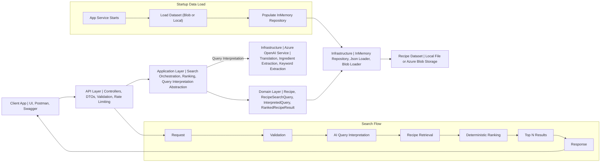

# Recipe Search API

ASP.NET Core Web API for recipe search using ingredients and natural language queries.

The API supports deterministic recipe ranking and Azure OpenAI based multilingual query interpretation.

---

## Live Demo

Swagger UI:
https://recipe-search-api-a8cwexa9fag3fyg2.westeurope-01.azurewebsites.net/swagger

---

## Deployment

Deployed on Azure App Service.

Cloud resources used:

- Azure App Service
- Azure Blob Storage
- Azure OpenAI

---

## Project Overview

This project provides a backend API for searching recipes from a recipe dataset.

Supported search modes:

- ingredient based search
- free text search
- mixed search
- multilingual query interpretation
- deterministic ranking
- request validation
- Swagger UI testing

The system separates AI based query understanding from deterministic retrieval and ranking.

---

## Architecture

### System Diagram and Runtime Flow



```text
src/
 ├── RecipeSearch.Api
 ├── RecipeSearch.Application
 ├── RecipeSearch.Domain
 └── RecipeSearch.Infrastructure

tests/
 └── RecipeSearch.Tests
```

### API

Responsible for:

- controllers
- request and response DTOs
- validation
- Swagger configuration
- dependency injection

### Application

Responsible for:

- search orchestration
- ranking logic
- service contracts
- query interpretation abstraction

### Domain

Contains:

- Recipe
- RecipeSearchQuery
- InterpretedQuery
- RankedRecipeResult

### Infrastructure

Responsible for:

- dataset loading
- in memory repository
- Azure OpenAI query interpretation
- external service integration

---

## Ranking and Scoring

Recipe search uses deterministic scoring.

Each searched ingredient is scored by match strength:

- `+6` exact ingredient phrase match
- `+4` strong phrase or full token match within one ingredient line
- `+1` weak partial token match

Keywords are scored as:

- `+3` keyword match in recipe name
- `+2` keyword match in ingredients text

An additional `+2` bonus is added if a searched ingredient is present in the recipe name.

The final score is the sum of all matched rules.

Results with score `0` are excluded.

Results are returned in descending score order.

---

## AI Usage

AI is used only for query interpretation.

This includes:

- multilingual input normalization
- translation to English search terms
- ingredient extraction from free text
- keyword extraction from recipe intent

The prompt is designed to extract only retrieval relevant ingredients and recipe intent terms while excluding generic filler words and helper verbs.

The AI output is converted into a structured query model containing:

- normalized ingredients
- normalized keywords
- translated query
- detected language

Recipe retrieval and ranking remain deterministic.

---

## Data Loading

Recipe data is loaded once during application startup and stored in memory for fast read access during search.

Supported data sources:

- local dataset file for local development
- Azure Blob Storage for deployed environments

The active source is selected through configuration.

After startup, all searches use the in memory repository to keep retrieval deterministic and low latency.

---

## Unit Tests

Unit tests cover the core backend behavior.

Covered components:

- `JsonRecipeLoader`
- `RecipeSearchService`
- `RecipeRankingService`

Tests verify:

- dataset parsing
- field mapping
- search orchestration
- dependency interaction
- ranking order
- zero score filtering
- top limit handling
- stronger match prioritization

---

## How to Run

### Local dataset mode

Place the dataset file in:

```text
data/20170107-061401-recipeitems.json
```

Then run:

```bash
dotnet restore
dotnet build
dotnet run --project src/RecipeSearch.Api
```

### Blob Storage mode

Configure Blob Storage and run the API without a local dataset file.

Swagger:

```text
http://localhost:5064/swagger
```

---

## Configuration

Required configuration depends on the selected data source and whether AI query interpretation is enabled.

Example user secrets:

```bash
dotnet user-secrets set "AzureOpenAI:Endpoint" "<endpoint>"
dotnet user-secrets set "AzureOpenAI:ApiKey" "<api-key>"
dotnet user-secrets set "AzureOpenAI:DeploymentName" "<deployment-name>"
dotnet user-secrets set "BlobStorage:ConnectionString" "<connection-string>"
```

---

## Example Requests

### Ingredient normalization

```json
{
    "ingredients": ["kyckling", "ris"],
    "query": "",
    "language": "sv",
    "top": 5
}
```

Expected normalized input:

```json
{
    "normalizedIngredients": ["chicken", "rice"]
}
```

### Multilingual free text interpretation

```json
{
    "ingredients": [],
    "query": "Jag vill laga något starkt med fisk och kokosmjölk",
    "language": "sv",
    "top": 5
}
```

Expected normalized input:

```json
{
    "normalizedIngredients": ["fish", "coconut milk"],
    "normalizedKeywords": ["spicy"]
}
```

---

## Current Limitations

- in memory dataset
- no persistent storage
- no semantic vector search
- no synonym dictionary
- rule based ranking only

These tradeoffs are intentional to keep the system predictable, traceable, and production minded for the scope of the assignment.
